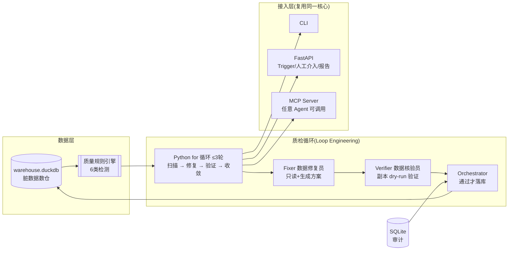

<div align="center">

# 🔄 Data Quality Loop — 数据质量巡检循环

**让 AI 像质检工程师一样无人值守地发现数据问题、修复、验证、收敛** —— Loop Engineering 独立作品

`Loop Engineering` `Maker-Checker` `DuckDB` `DeepAgents` `副本 dry-run` `SQLite 审计`


</div>

---

## ✨ 核心亮点

- **无人值守质检循环**：扫描数仓 → 发现异常（空值/主键重复/引用悬空/日期格式/金额勾稽/枚举不一致）→ 自动修复 → 独立验证 → 收敛或升级人工
- **Maker-Checker 硬权限隔离**：Fixer（数据修复员）只生成方案不落库；Verifier（数据核验员）只读 + 副本验证；Orchestrator 验证通过才落库
- **副本 dry-run 先行**：任何修复先在内存副本验证，通过才写主库——修坏了也伤不到真实数据
- **循环控制权在代码**：Python `for` 循环决定轮次（≤3），不靠 LLM 自觉，杜绝空转
- **SQLite 审计**：每次扫描/修复/归档/升级全量落库，跨会话可查
- **三端接入一核心**：CLI / FastAPI / MCP 复用同一循环，不做第二套逻辑
- **评测驱动**：埋 7 个已知问题，跑完统计修复率/残留/新问题——**100% 收敛，零残留，零新问题**

## 🎬 Demo

```
[扫描] orders → 发现 4 个异常:
   pk_duplicates(30行)  empty_rate(300行)  date_format(100行)  reference_integrity(50行)

[第1轮] Fixer 生成修复方案(4条SQL) → Verifier 副本验证
   ❌ 去重SQL用了 PostgreSQL 的 ctid(DuckDB 不支持) → 返回问题清单

[第2轮] Fixer 靶向修正(ctid → rowid + ROW_NUMBER) → Verifier 副本重跑质检
   ✅ 目标异常全消失、无新异常 → Orchestrator 落库 → 归档

🎉 表 orders 质检完成(2轮收敛)
```

## 🏗️ 系统架构



**质检链路**：`扫描异常 → Fixer 生成修复方案 → Verifier 副本验证(重跑质检) → Orchestrator 落库 → SQLite 审计 → 收敛或升级人工`

## 🚀 快速开始

### 1. 环境

```bash
# Python 3.12
pip install -r requirements.txt
cp .env.example .env   # 填入 DeepSeek API Key
```

### 2. 造脏数据（埋 7 个已知问题）

```bash
python scripts/gen_dirty_data.py
python scripts/scan_check.py        # M1 验收:扫描能发现全部已知问题
```

### 3. 跑质检循环（CLI）

```bash
# 一次性跑全部表
python -m eval.run_eval             # 收敛评测:修复率/残留/新问题

# 持续监控(每30秒扫描一次)
python -m data_quality_loop.data_quality_loop --once
```

### 4. 接入层

```bash
# FastAPI(扫描/异常/触发修复/报告/人工介入)
PYTHONPATH=src python -m uvicorn data_quality_loop.api.app:app --port 8500

# MCP Server(任何 Agent 可调用质检)
PYTHONPATH=src python -m data_quality_loop.mcp
```

## 📂 项目结构

```
Data_Quality_Loop/
├── configs/
│   ├── quality_rules.yaml      # 质量规则配置(声明式,加表不改代码)
│   └── settings.yaml
├── scripts/
│   ├── gen_dirty_data.py       # 造脏数据 + 已知问题清单(种子42可复现)
│   └── scan_check.py           # M1 验收
├── data/
│   ├── warehouse.duckdb        # 被质检数仓
│   └── quality_audit.db        # SQLite 审计
├── src/data_quality_loop/
│   ├── quality_rules.py        # 质量规则引擎(6类检测)
│   ├── data_quality_loop.py    # 核心循环(Fixer/Verifier/Orch + Python控制)
│   ├── audit.py                # SQLite 审计
│   ├── api/                    # FastAPI 接入
│   └── mcp/                    # MCP Server 接入
├── skills/data-quality-fixer/
│   └── SKILL.md                # 质量修复标准(渐进加载)
├── eval/
│   ├── known_issues.json       # 已知问题清单(评测基准)
│   ├── run_eval.py             # 收敛评测
│   └── test_mcp.py             # MCP 冒烟测试
└── tests/
```

## 🧪 收敛评测

评测 = 埋 7 个已知问题 → 跑完循环 → 重扫质检比对：

| 指标 | 结果 |
|------|------|
| 修复率 | **100% (7/7)** |
| 残留问题 | **0 个** |
| 新引入问题 | **0 个** |
| 平均收敛轮数 | **1.3**（orders 2轮 / summary 1轮 / customers 1轮） |

```bash
python -m eval.run_eval
```

## 🔌 接入

### FastAPI（工程层）

| 接口 | 作用 |
|------|------|
| `GET /api/anomalies` | 当前异常清单 |
| `POST /api/fix/{table}` | 对表跑一轮质检循环 |
| `POST /api/scan` | 触发全表循环 |
| `GET /api/report/{table}` | 质检报告(审计) |
| `POST /api/escalations/{table}/resolve` | 人工介入 |

+ HTTPBearer 鉴权（`.env` 配 `API_TOKEN`，留空开发模式放行）

### MCP（数据治理能力标准化输出）

```json
// Claude Desktop / Claude Code 配置
{
  "mcpServers": {
    "data-quality-loop": {
      "command": "python",
      "args": ["-m", "data_quality_loop.mcp"],
      "env": { "PYTHONPATH": "D:/Data_Quality_Loop/src" }
    }
  }
}
```

工具：`scan_anomalies()` / `run_quality_check(table)` / `get_quality_report(table)` / `list_quality_tables()`

## 🧹 工程化

- **线程安全**：deepagents 线程池并发访问 duckdb（非线程安全）→ 全局锁保护
- **副本沙盒**：修复在内存副本验证，不直接写主库
- **审计**：SQLite 跨会话持久化（修复记录/审计日志/循环状态）
- **成本**：Checker 用弱模型(flash)降成本；全链路纯文本 LLM；本地 DuckDB 零部署

## 📜 License

[MIT](LICENSE) © 2026 auron-lmh
